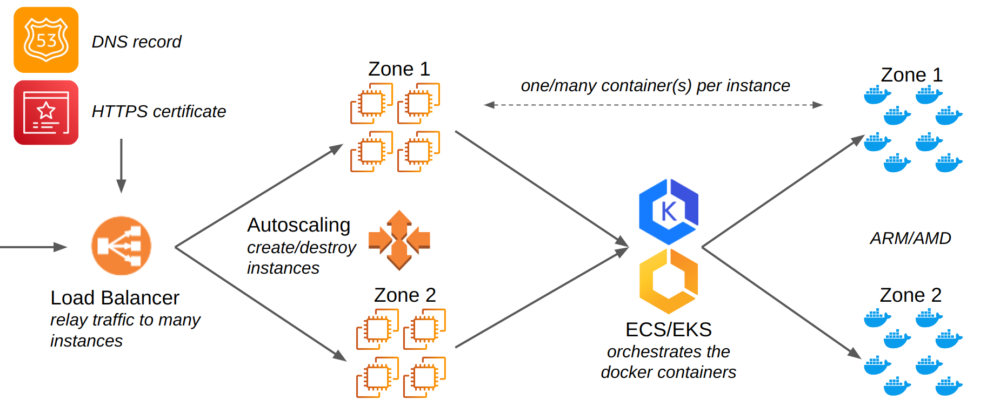

# AWS microservice Terraform module

Terraform module which creates a microservice for the following specifications:

- [ ] ECS
  - [x] Fargate
  - [ ] EC2
    - [x] CPU
    - [x] GPU
    - [x] Inferentia
    - [ ] Trainium
    - [ ] Gaudi
- [ ] EKS
  - [ ] Fargate
  - [ ] EC2

## Architecture

## ECS vs EKS equivalent

|         ECS          |    EKS     |
| :------------------: | :--------: |
|       cluster        |  cluster   |
|       service        | node-group |
|         task         |    node    |
|   task-definition    | deployment |
| container-definition |    pod     |

## Errors

### The closest matching container-instance `<id>` has insufficient memory available. For more information, see the Troubleshooting section of the Amazon ECS Developer Guide

It means that the memory given to the container or the service or both is superior to what is allowed. ECS requires a certain amount of memory to run and is different for each instance. They are hardcoded currently in microservice.ecs.instance

### Scaling activity `<id>`: Failed: We currently do not have sufficient `<instance_type>` capacity in the Availability Zone you requested (us-east-1c). Our system will be working on provisioning additional capacity. You can currently get `<instance_type>` capacity by not specifying an Availability Zone in your request or choosing us-east-1a, us-east-1b, us-east-1d, us-east-1f. Launching EC2 instance failed

It means that not every available zone has an instance available. Unfortunately AWS does not have enough capacity in some regions. A possible solution would be to retry deploying the microservice until it is successful.